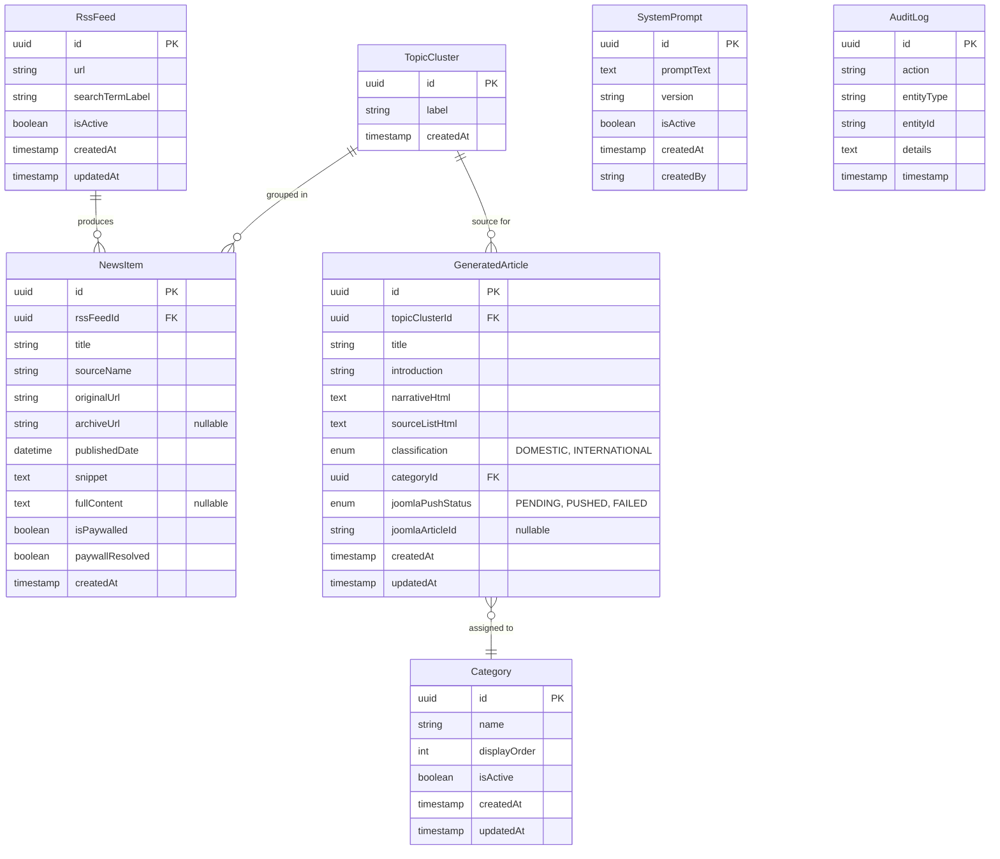

# Architectural Design Document (ADD)

**Project:** Opgelucht Content Pipeline  
**Client:** Rookvrije Generatie NL  
**Version:** 2.0  
**Date:** February 10, 2026

---

## 1. Introduction

### 1.1 Purpose
This document provides a comprehensive architectural overview of the "Opgelucht" AI-Powered Newsletter Automation Pipeline. It details the system's components, data structures, external integrations, and design decisions to guide the development and maintenance of the system.

### 1.2 Scope
The architecture describes a standalone web application designed to ingest RSS feeds, process news items using AI, and push draft content to a Joomla CMS. The system is designed for a single-server deployment environment using lightweight, maintainable technologies.

### 1.3 Architectural Goals
- **Simplicity:** Minimize operational overhead (No external DB server).
- **Maintainability:** Strong typing (TypeScript/Zod) and clear separation of concerns.
- **Reliability:** Graceful handling of external dependencies (APIs, Paywalls).
- **Extensibility:** Easy addition of new feeds or categories.
- **Client Autonomy:** Enable editorial control over prompts and configurations without code changes.

---

## 2. Architectural Overview

The system follows a **2-Tier Architecture**:
1.  **Presentation & Application Tier:** Next.js Application (Handling UI, API, and Business Logic)
2.  **Data Tier:** SQLite Database (File-based storage)

### 2.1 System Context Diagram

```mermaid
graph TD
    User[Editorial Staff] -->|HTTPS| System[Opgelucht Pipeline\n(Next.js)]
    
    System -->|Fetch RSS| Google[Google Alerts RSS]
    System -->|Generate/Classify| OpenAI[OpenAI API]
    System -->|Resolve Paywall| Archive[Archive Services\n(archive.ph, 1ft.io, etc.)]
    System -->|Create Draft| Joomla[Joomla CMS API]
    
    subgraph "Host Environment"
        System
        DB[(SQLite DB)]
        System <--> DB
    end
```

---

## 3. Component Architecture

The Next.js application is structured into logical layers to ensure separation of concerns.

### 3.1 Frontend Layer (React)
Built with React, Tailwind CSS, and React Hook Form.
- **Dashboard Component:** Visualization of Topic Clusters and News Items.
- **Feed Manager:** CRUD interface for `RssFeed` configuration.
- **Category Manager:** CRUD interface for `Category`.
- **Prompt Manager:** Version control interface for `SystemPrompt`.
- **Article Reviewer:** Editor interface for reviewing, regenerating, and pushing articles.

### 3.2 API Layer (Next.js)
Exposes endpoints for the frontend and handles requests.
- **API Routes (`/api/*`):** RESTful endpoints for data retrieval and actions.
- **Server Actions:** Direct function calls for form submissions and mutations (Next.js App Router pattern).
- **Validation Middleware:** Zod schemas validate all incoming requests.

### 3.3 Service Layer (Business Logic)
Encapsulates the core logic, decoupled from the HTTP transport.
- **RSS Ingestion Service:** Fetches feeds, parses XML (using `rss-parser`), extracts metadata.
- **Deduplication Engine:** Algorithms (fuzzy string matching / time-windowing) to group `NewsItems` into `TopicClusters`.
- **Paywall Resolver:** Sequentially attempts to retrieve content from:
    1. Original URL
    2. `archive.ph`
    3. `1ft.io`
    4. `12ft.io`
    5. `web.archive.org`
- **LLM Client (Abstraction):** Wrapper around OpenAI API to handle prompt construction, retries, and parsing.
- **Article Generator:** Orchestrates the LLM to produce content matching the "Standard Pattern".
- **Joomla Client:** adapter for communicating with the Joomla REST API.

### 3.4 Data Access Layer
- **Drizzle ORM:** TypeScript-native ORM.
- **Schema Definitions:** Single source of truth for DB structure in TypeScript.
- **Migrations:** Automated migration management for SQLite.

### 3.5 Scheduled Jobs
- **Scheduler:** A lightweight internal cron (e.g., `node-cron` or Next.js Instrumentation hook) triggers the `RSS Ingestion Service` daily at 12:00.

---

## 4. Data Architecture

The system uses **SQLite** for persistence.

### 4.1 ER Diagram



### 4.2 Entity Detail Constraints
- **Foreign Keys:** Enforced by SQLite.
- **Indices:** Index on `publishedDate` to optimize dashboard sorting. Index on `url` to optimize deduplication checks.

---

## 5. External Integration Architecture

### 5.1 Google Alerts (RSS)
- **Method:** `rss-parser` library.
- **Constraint:** Idempotency is key. We hash the article GUID or URL to detect duplicates across fetch cycles.

### 5.2 OpenAI API
- **Model:** `gpt-4` (or latest stable variant).
- **Pattern:** Stateless HTTP requests.
- **Resilience:** `retry-axios` or custom wrapper implementing exponential backoff (2s, 4s, 8s) on 429/5xx errors.

### 5.3 Archive Services
- **Pattern:** Cascading Fallback (Chain of Responsibility).
- **Logic:** Try Service A -> Fail -> Try Service B -> Fail -> Try Service C -> Fail -> Use Original (with flag).

### 5.4 Joomla CMS API
- **Auth:** Bearer Token (stored in ENV).
- **Payload:** Maps `GeneratedArticle` fields to Joomla Article fields (`title`, `introtext` (intro + narrative), `catid`).
- **Error Handling:** If Joomla is down, update `joomlaPushStatus` to `FAILED` and allow retry from UI.

---

## 6. AI/LLM Architecture

### 6.1 Utilization
The LLM is a functional utility, not a vague "agent". It is invoked for specific, bounded tasks:
1.  **Classification:** Input (Title+Snippet) -> Output (Domestic/International).
2.  **Categorization:** Input (Title+Snippet) -> Output (Category ID).
3.  **Generation:** Input (List of `NewsItem` contents + `SystemPrompt`) -> Output (Structured Article).

### 6.2 Prompt Management
Prompts are stored in the database (`SystemPrompt` entity). This allows the application to pull the *active* prompt for every generation request.
- **Versioning:** New edits create new rows; only one is active.
- **Variables:** Prompts support placeholders (e.g., `{{source_articles}}`) that the Code replaces at runtime.

---

## 7. Security Architecture

### 7.1 Authentication
- **Admin Access:** Protected via Basic Auth (at middleware level) or a simple NextAuth.js provider, as minimal setup is required for the limited user base.

### 7.2 Data Security
- **API Keys:** Stored in `.env` file on the server. Never exposed to the client bundle.
- **Database:** SQLite file is located outside the web root (e.g., `./db/opgelucht.sqlite`), inaccessible via HTTP.

### 7.3 Input Validation
- **Zod:** Used universally.
    - Validate RSS feed content structure.
    - Validate API request bodies.
    - Validate Envs on startup.

---

## 8. Deployment Architecture

### 8.1 Strategy
- **Type:** Stateless Application + Stateful Disk.
- **Artifact:** The Next.js build output (standalone mode).
- **Data:** a `data` volume mount is required to persist the SQLite file if using containers, or a writable directory if running on bare metal.

### 8.2 Procedures
- **Startup:**
    1. Check ENV variables.
    2. Run Drizzle Migrations (`drizzle-kit migrate`).
    3. Start Next.js server.
    4. Initialize Scheduler.

---

## 9. Key Design Decisions (ADRs)

| ID | Decision | Rationale |
|----|----------|-----------|
| **ADR-001** | **Use SQLite** | Removes the need for a separate database server process (Postgres/MySQL), simplifying deployment and backup for the client. Sufficient performance for <50k records. |
| **ADR-002** | **Next.js Full Stack** | Unifies frontend and backend in one language (TS) and one project structure. Reduces context switching and build complexity. |
| **ADR-003** | **Drizzle ORM** | Provides best-in-class TypeScript inference compared to Prisma or TypeORM. Lightweight and SQL-like. |
| **ADR-004** | **Tailwind CSS** | Speeds up UI development and ensures consistency without maintaining large custom stylesheets. |
| **ADR-005** | **Zod Validation** | Ensures type safety at runtime boundaries (API/DB), preventing "garbage in". |
| **ADR-006** | **OpenAI API** | Chosen for superior Dutch language performance in GPT-4 class models compared to open-source alternatives. |

---

## 10. Error Handling & Resilience

### 10.1 Strategies
- **Circuit Breaker:** Not strictly necessary for this scale, but simple timeouts are enforced on all external calls (5s for RSS, 60s for LLM).
- **Job Recovery:** If the scheduled Fetch Job fails, it simply logs the error. The next scheduled run (or a manual trigger) will pick up new items. State is not locked.
- **User Feedback:** Errors during manual actions (Generation, Push) are displayed via Toast notifications in the UI.

### 10.2 Logging
- **Application Logs:** `console.log` / `console.error` (captured by PM2 or container logs).
- **Audit Logs:** High-value business actions are written to the `AuditLog` table.
